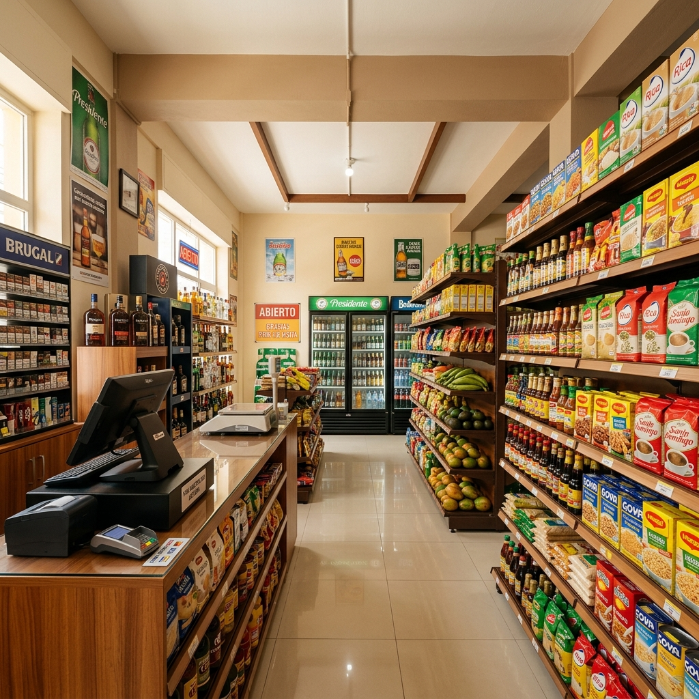

  

  <h1>TuColmadoRD</h1>
  
<b>El ERP y Punto de Venta SaaS Definitivo para Colmados en República Dominicana</b>

  

    <a href="https://tucolmadord.com">Sitio Web</a> •
    <a href="https://tucolmadord.com">Demo</a> •
    <a href="https://tucolmadord.com/contacto">Contacto</a>
  

---

## 🏪 Transformando la Cultura del Colmado

**TuColmadoRD** es una plataforma integral diseñada específicamente para las necesidades del comercio minorista y los colmados en la República Dominicana. Combinamos la rapidez de un Punto de Venta (POS) optimizado para pantallas táctiles con la potencia de un sistema en la nube (SaaS), permitiendo a los propietarios administrar su negocio desde cualquier lugar.

Dile adiós a las libretas de "fiado", al descuadre de caja y a las complicaciones fiscales. TuColmadoRD automatiza, asegura y simplifica toda la operación de tu negocio.

### 🌟 Beneficios Clave

- **Ventas Súper Rápidas:** Interfaz de Punto de Venta (POS) intuitiva, compatible con lectores de códigos de barra e impresión de recibos al instante.
- **Facturación Electrónica (e-CF):** Integración nativa con la DGII para emisión de Comprobantes Fiscales Electrónicos. ¡Cumple con la ley sin esfuerzo!
- **Control de "Fiados":** Módulo dedicado para gestionar créditos de clientes, límites de deuda y abonos con historial transparente.
- **Gestión de Inventario Inteligente:** Alertas de bajo stock, control de productos con múltiples unidades de medida y reportes de rentabilidad.
- **Control de Delivery Seguro:** Verificación por código y proximidad GPS para asegurar que las entregas lleguen a su destino correctamente.
- **Manejo de Empleados y Turnos:** Control de acceso por roles (Cajero, Delivery, Administrador) y cuadre de caja (apertura y cierre de turnos).
- **Acceso 100% en la Nube:** Monitorea las ventas de tus sucursales en tiempo real desde tu celular o computadora a través del panel de administración web.
- **Soporte Offline (Escritorio):** Aplicación de escritorio instalable `.exe` para garantizar que la operación en caja nunca se detenga, con sincronización automática a la nube.

---

## 🛠 Arquitectura Tecnológica de Vanguardia

Diseñado para escalar y ofrecer alta disponibilidad, TuColmadoRD utiliza una arquitectura robusta:

- **Frontend & POS:** Angular 19, TailwindCSS, DaisyUI (Progresive Web App & Escritorio).
- **Backend (Core API):** .NET 10 (C#), Arquitectura Limpia, CQRS, MediatR.
- **Microservicio Auth:** Node.js (Express), MongoDB para manejo ágil de perfiles de usuario.
- **Microservicio Fiscal (e-CF):** Python (Flask) para generación y firmado de XMLs normativos de la DGII.
- **Bases de Datos:** PostgreSQL (Datos relacionales robustos) y MongoDB (Logs y Auth).
- **Infraestructura & CI/CD:** Docker Compose, Traefik (Proxy Inverso), y despliegues automatizados con GitHub Actions.

---

## 💼 ¿Eres Dueño de un Colmado?

No dejes que la administración manual limite el crecimiento de tu negocio. Moderniza tu colmado hoy con **TuColmadoRD**.

👉 **[Visita tucolmadord.com para agendar una demostración](https://tucolmadord.com)** 👈

---

  <i>Desarrollado con ❤️ en República Dominicana por <b>Synset Solutions S.R.L.</b></i> 
  © 2026 Todos los derechos reservados.

